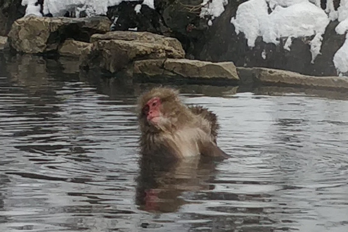

------------------------------------------------------------------------
 

 
------------------------------------------------------------------------

***Hi, I'm Jeremy.***
 
 
An aspiring data scientist, currently based in __*San Antonio, TX*__. While attending the University of Texas in San Antonio, I obtained my B.S.in Mathematics with a Minor in Statistics. I worked as a software Developer with HCL Technologies working with Java Back-end Development.

Intrigued by big data, obsessed with problem solving. Incredibly meticulous, and demand optimization. I work well on my own, and great within groups.

When circumstances allow it, I love to travel. My favorite trip was to Japan, and a highlight was visiting The Jigokudani monkey park near Nagano. I mainly want an excuse to post a picture of a macaque in a hotspring , so here's a reward for visiting my site.  
 
 

 
 
 

### How to Contact Me  

***

***Email: jeremy.koerner4495@gmail.com***

 
***Mobile: (210)473-0719***

 
***Twitter: ***[***@koernerjeremy***](https://twitter.com/KoernerJeremy)

 
***Twitter: ***[***jeremykoerner***](https://github.com/jeremykoerner)

